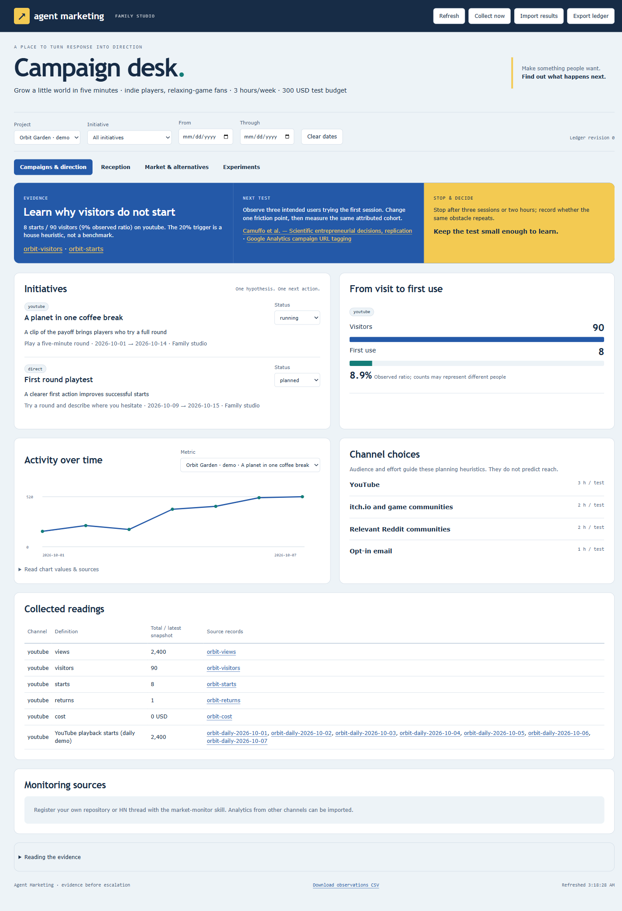

# agent-marketing

An evidence-led marketing plugin for the tools, apps, games and projects your family makes with AI. It helps an agent choose an audience and channels, research alternatives, plan campaigns and collateral, collect results, inspect reception, and decide what to try next.

The local campaign desk connects each recommendation to a source. It shows activity, attributed first-use paths, reviewed reactions, viability evidence, alternatives and experiment uncertainty. CLI and UI share one portable JSON ledger. No account subscription or runtime npm dependency is required.



## Install the plugin

In Claude Code, add the [Hartye marketplace](https://github.com/ehartye/hartye-claude-plugins), then install:

```text
/plugin marketplace add ehartye/hartye-claude-plugins
/plugin install agent-marketing@hartye-plugins
/agent-marketing:market-setup
```

Node 24+ is required. `market-setup` installs a verified runtime outside the plugin cache. After a plugin update the launcher refreshes the runtime itself on first use, so you do not need to run it again; run `market-setup` to check or repair explicitly. See the [releases](https://github.com/ehartye/agent-marketing/releases) for what changed in each version.

## Use it

Ask Claude for the work, and the skills run the CLI for you: `market-discover` and `market-strategy` to choose an audience and channels, `market-campaign` to plan a test, `market-research` to save a sourced report you can read in the desk (Research fit), `market-monitor` to collect or import results and open the local campaign desk, `market-insights` and `market-experiment` to decide what to do next. The skills use a real workspace file you name, and keep synthetic demo data in a separate one. The desk opens at `http://127.0.0.1:4318`.

## From a source checkout

This section is for working on the plugin itself or trying it without installing. Plugin users can skip it.

Node 24+:

```powershell
node scripts/setup.mjs
node scripts/run-managed.mjs demo --workspace .agent-marketing/demo.json
node scripts/run-managed.mjs serve --workspace .agent-marketing/demo.json
```

Open `http://127.0.0.1:4318`. Demo metrics are synthetic. Use a different file for a real studio:

```powershell
node scripts/run-managed.mjs init --workspace .agent-marketing/workspace.json
node scripts/run-managed.mjs help
```

Setup installs a content-verified runtime under `~/.agent-marketing/releases/` and writes a receipt. The launcher checks it against the source; rerun setup after updates. `AGENT_MARKETING_HOME` can relocate the install. Existing init/demo files are preserved.

## Skills

| Skill | Outcome |
|---|---|
| market-setup | Install/check the managed runtime |
| market-discover | Audience, value, readiness and evidence brief |
| market-strategy | Channel choice with effort, risk and maintenance tradeoffs |
| market-research | Paying demand, underserved/language markets, alternatives and a sourced decision report |
| market-campaign | Testable campaign, CTA, tagged links and review plan |
| market-collateral | Actual reviewable copy, demo/asset brief or creator kit |
| market-monitor | Supported API collection, export imports and local desk |
| market-insights | Reach/reception/viability review and a bounded next action |
| market-experiment | Experiment design, counts, uncertainty and stop review |

The `.claude-plugin` manifest follows the sibling agent projects. The plugin is listed in hartye-plugins; this repository can also be loaded as a local plugin in a compatible host. The skills use relative resources and the absolute managed launcher. The skill entry points use portable Agent Skills metadata; retain the repository layout and shared resources when loading them. Optional agent-vids/prose/sprites/beeps integrations are advisory and do not affect core operation.

## What the tools do

`init`, `demo`, `validate`, `import`, `put`, `document`, `report`, `advise`, `channels`, `experiment`, `utm`, `monitor`, `serve`, `export`, `rules`, `help`. See the [complete CLI and record contract](docs/CLI.md), [example ledger](examples/studio.json) and [CSV example](examples/observations.csv).

Strategy and campaign skills save their full Markdown briefs inside the workspace: strategy on the project, campaign brief on each initiative. Reopen or download them in **Decide & plan**, or use `document show/export`. Full JSON backups include these documents. Existing ledgers remain readable; external assets and document history are not bundled.

Monitoring reads public GitHub stars, optional repository traffic with an appropriately scoped `GITHUB_TOKEN`, and public HN threads through official APIs. Other platform results use authorized JSON/CSV exports normalized to the documented observation schema. Collection errors preserve previous readings; repeated snapshots do not inflate totals. Monitoring is one-shot; an owner-chosen scheduler can call it periodically. No social posting, outreach, ad spending or scheduler is installed.

## Marketing craft

[Craft guides](craft/GUIDE.md), [queryable rules](craft/rules.json), [channel cards](library/channels.json) and [dated research references](craft/REFERENCES.md) cover discovery, positioning, competition, campaigns, collateral, measurement, reception and experiments. They separate research findings from planning heuristics and explain transfer limits.

Ask market-research “Which gamer population is underserved, including non-English markets?” for a saved [demand report](library/demand-report.md): purchasing evidence, supply gaps, sources and their limits, delivery tradeoffs, and one validation test. The [worked gamer example](docs/research/gamer-demand-2026-10-08.md) treats regional opportunities as hypotheses until genre-specific supply and paid conversion are checked. Research runs through the agent skill; the CLI's numeric `report` command summarizes ledger observations.

Views, likes and comments describe attention or a captured feedback sample. They do not establish market viability, unique cross-platform reach or causal ad lift. The desk keeps those meanings separate. The English lexical sentiment helper is an unvalidated suggestion; review labels in source context. Experiment intervals display uncertainty; free-text duration/stopping rules require operator review.

## Development

```powershell
npm test
npm run check
node scripts/build-references.mjs --check
```

Node's native test runner exercises ledger integrity, compatible metrics, experiment bounds, CSV/JSON journeys, collector failures, shared UI routes and runtime receipts. The [verification report](docs/VERIFICATION.md) records all 27 passing tests, browser interactions, live API checks, independent review and the paired skill evaluation. No build step is required. MIT license.
